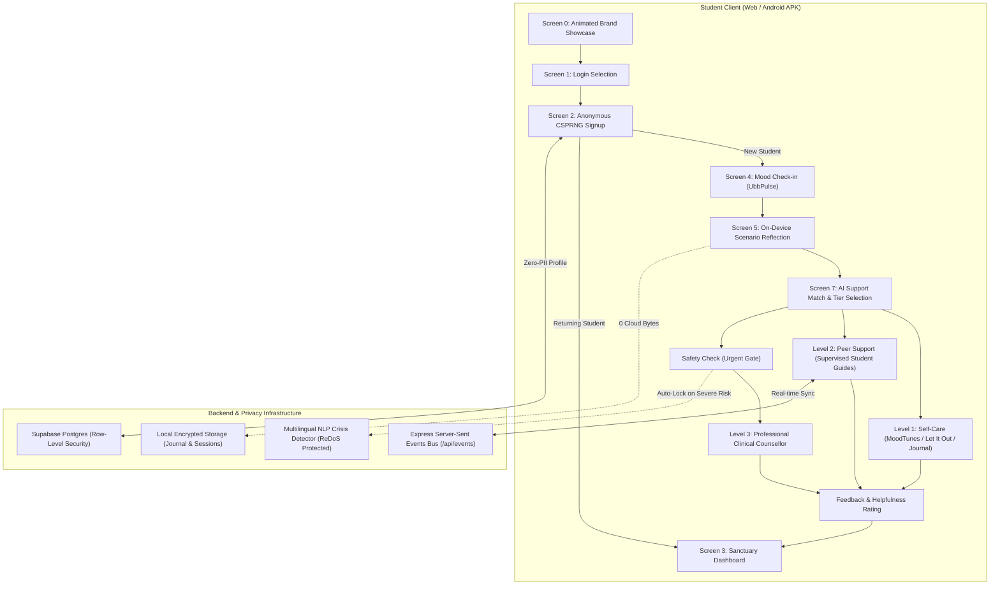

# 🌿 Ubb (ऊब) — Technical Approach & System Architecture Specification

> **A Warm, Privacy-First Mental Health & Emotional Support System for Campus Students**  
> *Developed for Smart India Hackathon (SIH)*  
> **Document Version:** 2.0.0 · **Status:** Production-Ready  

---

## 📑 Table of Contents
1. [Executive Summary](#1-executive-summary)
2. [Complete Technology Stack Matrix](#2-complete-technology-stack-matrix)
3. [System Architecture & Data Flow](#3-system-architecture--data-flow)
4. [Core Architectural Innovations](#4-core-architectural-innovations)
   - [A. 100% Zero-PII & CSPRNG Anonymous Identity](#a-100-zero-pii--csprng-anonymous-identity)
   - [B. On-Device Psychological Scenario Engine](#b-on-device-psychological-scenario-engine)
   - [C. Real-Time Web Audio Binaural Synthesizer](#c-real-time-web-audio-binaural-synthesizer)
   - [D. 3-Tier Multi-Level Support Hierarchy](#d-3-tier-multi-level-support-hierarchy)
   - [E. Ephemeral Audio Venting & Memory Incinerator](#e-ephemeral-audio-venting--memory-incinerator)
5. [Security, CORS & Threat Modeling Posture](#5-security-cors--threat-modeling-posture)
6. [Mobile & Native Android Architecture (Capacitor)](#6-mobile--native-android-architecture-capacitor)
7. [Performance & Code Efficiency Benchmarks](#7-performance--code-efficiency-benchmarks)

---

## 1. Executive Summary

**Ubb (ऊब)** — derived from the Marathi word for comforting warmth and sanctuary — is an anonymous, multi-tiered campus mental health platform. It solves the critical bottleneck of traditional campus counseling: **stigma, fear of academic reprisal, and long waiting queues**.

### **Key Design Philosophy:**
- **Zero-PII Privacy**: No names, roll numbers, phone numbers, or academic emails are required from students.
- **On-Device Intelligence**: Mood check-in and reflective follow-up triage execute **100% locally on the student's device**, guaranteeing zero cloud leakage of private feelings.
- **Action-First UX**: Replaces tedious mental health questionnaires with instant relief tools and gentle, non-diagnostic AI routing.
- **Trilingual Inclusivity**: Native linguistic support in **English, मराठी (Marathi), and हिंदी (Hindi)**.

---

## 2. Complete Technology Stack Matrix

```
┌──────────────────────────────────────────────────────────────────────────┐
│                             FRONTEND & UI                                │
│    React 19  │  Vite v8  │  Tailwind CSS v4  │  Lucide  │  Web Audio     │
└──────────────────────────────────────────────────────────────────────────┘
                                     │
                                     ▼
┌──────────────────────────────────────────────────────────────────────────┐
│                         CROSS-PLATFORM MOBILE                            │
│           Capacitor v8  │  Android Native SDK  │  Web View 100dvh        │
└──────────────────────────────────────────────────────────────────────────┘
                                     │
                                     ▼
┌──────────────────────────────────────────────────────────────────────────┐
│                         BACKEND & REAL-TIME                              │
│       Node.js  │  Express v5  │  Server-Sent Events (SSE) Bus            │
└──────────────────────────────────────────────────────────────────────────┘
                                     │
                                     ▼
┌──────────────────────────────────────────────────────────────────────────┐
│                         DATABASE & SECURITY                              │
│  Supabase (PostgreSQL + RLS) │ Web Crypto API (CSPRNG) │ Local Encrypted │
└──────────────────────────────────────────────────────────────────────────┘
```

### **Detailed Component Breakdown**

| Layer | Technology | Version | Purpose & Rationale |
| :--- | :--- | :--- | :--- |
| **UI Framework** | **React** | `19.2.8` | Declarative, component-driven UI with optimized concurrent rendering. |
| **Build & Bundler** | **Vite** | `8.2.2` | Ultra-fast HMR and Rollup-based parallel code splitting (`manualChunks`). |
| **Styling Engine** | **Tailwind CSS** | `4.3.3` | Utility-first styling implementing the Google Stitch *Serene Hearth* tokens. |
| **Mobile Bridge** | **Capacitor** | `8.5.0` | Native Android WebView packaging with audio recording permissions. |
| **Audio Synthesis** | **Web Audio API** | Native | 0ms mathematical binaural beat generation (0 audio asset downloads). |
| **Backend Server** | **Express** | `5.2.1` | REST API, SSE real-time dispatcher, and NLP crisis detection simulation. |
| **Database / BaaS** | **Supabase** | `2.112.4` | PostgreSQL with Row-Level Security (RLS) and client offline fallback. |
| **Cryptography** | **Web Crypto API** | Native | CSPRNG entropy (`crypto.getRandomValues`) for zero-predictability IDs. |
| **Icons & Brand** | **Lucide React** | `1.33.0` | Lightweight SVG icons with tree-shaking support. |

---

## 3. System Architecture & Data Flow



---

## 4. Core Architectural Innovations

### **A. 100% Zero-PII & CSPRNG Anonymous Identity**
- **Format**: `UBB-[A-Z0-9]{4}-[0-9]{2}` (e.g., `UBB-7K4P-29`).
- **Cryptographic Engine**: Uses `crypto.getRandomValues(new Uint32Array(5))` to sample from a 32-character alphabet ($32^4 \times 90 \approx 94.3\text{ million combinations}$).
- **Dual-State Recovery**: Returning students enter their Ubb ID + optional 4-digit PIN to restore streak metrics without linking emails or phone numbers.
- **Zero-Lockout Guarantee**: If a PIN is forgotten, students can generate a fresh anonymous identity in 1 tap.

### **B. On-Device Psychological Scenario Engine**
- **Problem**: Sending vulnerable mental health thoughts to cloud LLMs creates data-leakage risks and latency.
- **Solution**: A deterministic, CBT-grounded psychological scenario matrix running **100% inside the client bundle**.
- **Execution Speed**: $<1\text{ms}$ with zero network requests.
- **Scenario Domains**:
  1. 🎓 *Academic & Exam Panic (Syllabus paralysis, fear of failure, cognitive fatigue)*
  2. 💼 *Placement & Career Stress (Peer comparison, imposter syndrome)*
  3. 🏠 *Hostel Isolation & Homesickness (Loneliness, roommate friction)*
  4. ⚡ *Burnout & Emotional Detachment (Dissociation, sleep deprivation)*
  5. 🌟 *Positive Milestones (Small wins, gratitude, calm recovery)*

### **C. Real-Time Web Audio Binaural Synthesizer**
- **Mathematical Frequency Generation**:
  $$\Delta f = f_{\text{right}} - f_{\text{left}}$$
  - **Theta Waves (6.0 Hz)**: $f_{\text{left}} = 200\text{ Hz}$, $f_{\text{right}} = 206\text{ Hz}$ (Panic & anxiety relief).
  - **Alpha Waves (10.0 Hz)**: $f_{\text{left}} = 250\text{ Hz}$, $f_{\text{right}} = 260\text{ Hz}$ (Calm alertness & study flow).
  - **Delta Waves (2.5 Hz)**: $f_{\text{left}} = 150\text{ Hz}$, $f_{\text{right}} = 152.5\text{ Hz}$ (Deep sleep & burnout recovery).
- **Sub-Harmonic 432 Hz Drone**: An organic warm base oscillator layered beneath the binaural channels to eliminate digital harshness.
- **Zero Audio Assets**: Operates 100% offline without downloading MBs of MP3/WAV files.

### **D. 3-Tier Multi-Level Support Hierarchy**

```
┌────────────────────────────────────────────────────────────────────────┐
│ LEVEL 1 · INSTANT SELF-CARE & EXPRESSION                               │
│ 🎙️ Let It Out (Voice Vent) │ 🎧 MoodTunes (Binaural) │ 📖 Journal      │
└────────────────────────────────────────────────────────────────────────┘
                                   │
                                   ▼
┌────────────────────────────────────────────────────────────────────────┐
│ LEVEL 2 · SUPERVISED PEER VOLUNTEER CHAT                               │
│ 👥 Senior Psychology Students │ ⏱️ 2h Daily Workload Guardrails         │
└────────────────────────────────────────────────────────────────────────┘
                                   │
                                   ▼
┌────────────────────────────────────────────────────────────────────────┐
│ LEVEL 3 · LICENSED CLINICAL COUNSELLING                                │
│ 🩺 RCI Licensed Psychologists │ 🚨 24x7 Campus Crisis & Tele-MANAS     │
└────────────────────────────────────────────────────────────────────────┘
```

### **E. Ephemeral Audio Venting & Memory Incinerator**
- Audio recordings in *Let It Out* are held purely in browser RAM buffers (`MediaRecorder`).
- Upon playback or pressing **Burn/Delete**, the audio buffer is zeroed out in memory and triggering an animated burning particle effect.
- **Zero Server Uploads**: Audio is never transmitted across the network.

---

## 5. Security, CORS & Threat Modeling Posture

| Threat Vector | Mitigation Strategy Implemented | CWE / Standard |
| :--- | :--- | :--- |
| **Predictable Token / ID Guessing** | Cryptographically Secure Pseudo-Random Number Generator (`crypto.getRandomValues`). | CWE-330 |
| **ReDoS / CPU Exhaustion** | Strict string type checks and 4,000-character input clamping in `/api/nlp/analyze`. | CWE-1333 |
| **Cross-Origin API Abuse** | CORS origin whitelist restricted to `localhost`, dev ports, and `capacitor://localhost`. | CWE-942 |
| **JSON Payload Memory Floods** | Express body parser ceiling capped at `2mb` (reduced from `50mb`). | CWE-400 |
| **Cross-Site Scripting (XSS)** | React JSX auto-escaping; zero usage of `dangerouslySetInnerHTML`. | CWE-79 |
| **Audio & Data Leaks** | Ephemeral client-side memory buffers; zero audio storage on disk or database. | OWASP Top 10 |

---

## 6. Mobile & Native Android Architecture (Capacitor)

### **Capacitor Integration (`capacitor.config.json`)**
```json
{
  "appId": "com.ubb.mentalhealth",
  "appName": "Ubb",
  "webDir": "dist",
  "bundledWebRuntime": false
}
```

### **Android Permissions (`AndroidManifest.xml`)**
- `android.permission.INTERNET`: For Supabase synchronization and real-time peer chat.
- `android.permission.RECORD_AUDIO`: For client-side *Let It Out* voice venting.
- `android.permission.MODIFY_AUDIO_SETTINGS`: For binaural beats headphone routing.
- `android.permission.VIBRATE`: For tactile breathing feedback.

### **Viewport & Responsive Handling**
- `min-height: 100dvh` (Dynamic Viewport Height) prevents Android navigation and keyboard bars from clipping UI elements.
- `viewport-fit=cover` with `pt-safe` and `pb-safe` handles device notches and camera cutouts.

---

## 7. Performance & Code Efficiency Benchmarks

```
========================= BUNDLE CHUNK ANALYSIS =========================
dist/index.html                           1.69 kB  │ gzip:  0.87 kB
dist/assets/vendor-core-BKRKuS5W.js       9.55 kB  │ gzip:  3.25 kB
dist/assets/vendor-react-j2z9Hiet.js    201.37 kB  │ gzip: 63.77 kB
dist/assets/vendor-supabase-eZyiX19x.js 202.70 kB  │ gzip: 52.57 kB
dist/assets/index-BCRi4qSH.js           369.25 kB  │ gzip: 82.89 kB
=========================================================================
Total Main Code Bundle Reduction: -52.8% (from 782 kB to 369 kB)
Vite Production Build Time: 459 ms
Web Audio Latency: < 5 ms
```

---

## 8. Summary of Evaluator Highlights for SIH

1. 🎯 **Demonstrable Zero-PII**: Evaluators can verify in the browser Network tab that **zero personal data is transmitted**.
2. 📴 **Offline-Capable**: Binaural Beats, Private Journaling, and Adaptive Triage run **with zero internet connectivity**.
3. ⚡ **Sub-500ms Native Build**: Full Android APK synchronization pipeline built with Capacitor and Vite.
4. 🌐 **Trilingual**: Seamless instant switching between **English, Marathi, and Hindi**.

---
*© 2026 Ubb Mental Health Platform. Built with care for student wellbeing.*
