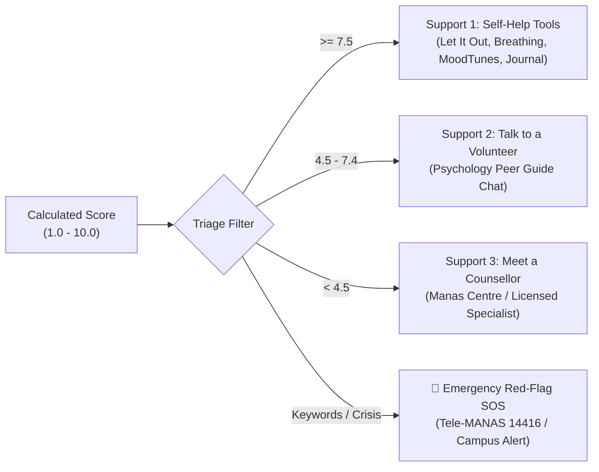
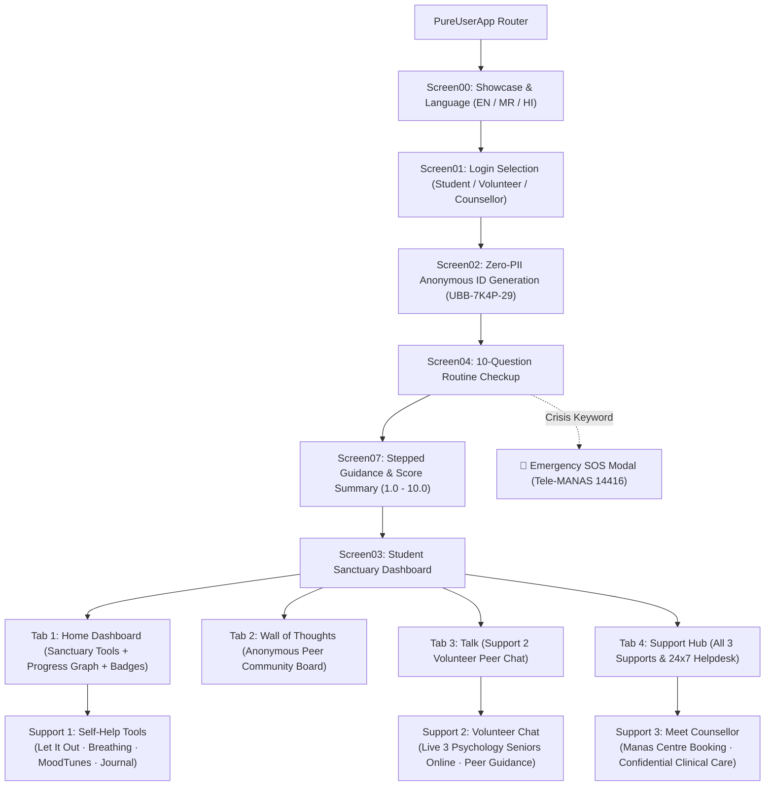

# 📜 Product Specification & Architecture Blueprint
# **Ubb (ऊब) — Student Mental Health Sanctuary**

---

## **1. Executive Summary & Philosophy**

**Ubb (ऊब)** — derived from the Marathi and Hindi concept of *"warmth, comfort, and safe haven"* — is a zero-stigma, zero-PII stepped-care mental health application designed for college and university ecosystems. 

### **Core Tenets:**
1. **Zero-PII Confidentiality**: No personal identifying information (phone, real name, email) is required. Identity is anchored on an ephemeral anonymous tag (`UBB-7K4P-29`) with an optional local PIN.
2. **Clinically Grounded Stepped Care**: Directs students to the least intrusive, most effective support tier based on objective psychometric scoring.
3. **Compassionate, Non-Punitive Design**: No guilt-inducing streaks or high-friction clinical forms.
4. **Offline-First Acoustic & Self-Help**: Native on-device Web Audio binaural beats and instant-wipe audio venting.

---

## **2. Psychometric Questionnaire & Scoring Model**

### **2.1 The 10-Question Verified Checkup**

| # | Domain | Question Text | Response Scale (1 to 5) | Coding |
|---|---|---|---|---|
| **$Q_1$** | **Overall Mood** | *How would you rate your overall mood and energy today?* | 1 (Terrible) $\to$ 5 (Great) | **Positive** (Score = Value) |
| **$Q_2$** | **Academic Pressure** | *How manageable has your academic/workload stress felt over the past few days?* | 1 (Overwhelming) $\to$ 5 (Fully Manageable) | **Positive** (Score = Value) |
| **$Q_3$** | **Sleep Quality** | *How rested and refreshed do you feel when waking up in the morning?* | 1 (Never rested) $\to$ 5 (Always refreshed) | **Positive** (Score = Value) |
| **$Q_4$** | **Anxiety & Restlessness** | *How often have you felt restless, anxious, or unable to relax recently?* | 1 (Almost never) $\to$ 5 (Constantly) | **Reverse** (Score = $6 - \text{Value}$) |
| **$Q_5$** | **Focus & Motivation** | *How easy has it been to stay focused and motivated on your daily tasks or studies?* | 1 (Very difficult) $\to$ 5 (Very easy) | **Positive** (Score = Value) |
| **$Q_6$** | **Social Connection** | *Have you felt connected to and supported by friends, family, or your peer group lately?* | 1 (Very isolated) $\to$ 5 (Well supported) | **Positive** (Score = Value) |
| **$Q_7$** | **Emotional Regulation** | *When unexpected stress arises, how confident do you feel in calming yourself down?* | 1 (Not confident at all) $\to$ 5 (Very confident) | **Positive** (Score = Value) |
| **$Q_8$** | **Future Outlook** | *How hopeful and positive do you feel about upcoming events, goals, or the future?* | 1 (Very pessimistic) $\to$ 5 (Very hopeful) | **Positive** (Score = Value) |
| **$Q_9$** | **Enjoyment & Hobbies** | *Have you taken time for activities, hobbies, or breaks that genuinely make you happy?* | 1 (Not at all) $\to$ 5 (Plenty of time) | **Positive** (Score = Value) |
| **$Q_{10}$** | **Self-Compassion** | *When things don't go according to plan, how often are you hard on yourself?* | 1 (Rarely hard) $\to$ 5 (Almost always hard) | **Reverse** (Score = $6 - \text{Value}$) |

---

### **2.2 Mathematical Min-Max Normalization Formula**

To convert the raw total points into a standardized, intuitive **1.0 to 10.0** user-facing wellbeing score:

$$\text{Score}_{[1, 10]} = \text{Target}_{\min} + \left(\frac{\text{Raw Total} - \text{Min}_{\text{possible}}}{\text{Max}_{\text{possible}} - \text{Min}_{\text{possible}}}\right) \times (\text{Target}_{\max} - \text{Target}_{\min})$$

Substituting the boundary values ($\text{Min}_{\text{possible}} = 10$, $\text{Max}_{\text{possible}} = 50$, $\text{Target}_{\min} = 1$, $\text{Target}_{\max} = 10$):

$$\text{Score}_{[1, 10]} = 1 + \left(\frac{\text{Raw Total} - 10}{40}\right) \times 9$$

#### **Step-by-Step Calculation Example:**
- **Positively Coded Sum ($Q_1, Q_2, Q_3, Q_5, Q_6, Q_7, Q_8, Q_9$)**:
  $$4 + 3 + 4 + 4 + 5 + 3 + 4 + 4 = 31$$
- **Reverse Coded Sum ($Q_4 = 2, Q_{10} = 2$)**:
  $$(6 - 2) + (6 - 2) = 4 + 4 = 8$$
- **Raw Total**:
  $$31 + 8 = 39$$
- **Final Normalized Score**:
  $$\text{Score} = 1 + \left(\frac{39 - 10}{40}\right) \times 9 = 1 + \left(\frac{29}{40}\right) \times 9 = 1 + 6.525 = \mathbf{7.525 \approx 7.5}$$

---

## **3. Stepped-Care Triage Engine**

| Wellbeing Tier | Score Threshold | Clinical Classification | Recommended Intervention |
|:---|:---|:---|:---|
| **Tier 1 (Support 1)** | **7.5 – 10.0** | Flourishing / Mild Strain | **Self-Help Sanctuary Tools**: 4-7-8 Breathing, Let It Out audio venting, MoodTunes acoustic therapy, Private journaling. |
| **Tier 2 (Support 2)** | **4.5 – 7.4** | Moderate Strain / Overwhelm | **Peer Volunteer Talk**: 1-on-1 confidential chat with trained psychology student guides (supervised by clinical faculty). |
| **Tier 3 (Support 3)** | **1.0 – 4.4** | High Distress / Persistent Low | **Professional Care**: Priority appointment booking at campus counselling centre (*e.g., Fergusson College Manas Centre*). |
| **Critical Tier (SOS)** | **Triggered** | Acute Crisis / Safety Alert | **Emergency SOS**: Immediate modal with 1-tap call to **Tele-MANAS (14416)**, **KIRAN (1800-599-0019)**, and campus rapid response. |

---

## **4. Safety Sentinel: Real-Time Red-Flag Keyword Detection**

The application monitors all free-text input fields (e.g., *"Other (describe)"* inputs, audio transcripts, and check-in text) for safety triggers.

### **Keyword Interception List:**
- `suicide`, `kill myself`, `end my life`, `want to die`, `don't want to live`, `hang myself`, `overdose`, `self-harm`, `cut myself`, `hurting myself`, `no point in living`.

### **Protocol Execution:**
1. **Immediate Execution Freeze**: Halts routine questionnaire flow.
2. **Emergency Modal Overlay**: Displays an empathetic, supportive intervention card.
3. **Direct Lifeline Dialing**:
   - **National Tele-MANAS Helpline**: `14416` / `1800-891-4416` (24x7, Free, Gov. of India)
   - **KIRAN Mental Health Line**: `1800-599-0019`
   - **Campus Counsellor Rapid Alert**: 1-tap confidential emergency alert dispatch.

---

## **5. "You Are Not Alone" Peer Benchmarking**

To alleviate stigma and counter *pluralistic ignorance* (the false belief that one is isolated in their struggles), the app computes cohort benchmarks:
- **Calculation**: Aggregates anonymized, localized check-in trends across student cohorts.
- **Contextual Copy**:
  > *"Your Score: **6.8 / 10** · You are not alone — **64% of college peers** reported elevated academic pressure this week."*

---

## **6. Gamification: Option 2 Mindful Milestone Badges**

Designed strictly as a **compassionate, non-punitive reward system**:

### **6.1 Badges Matrix:**
| Badge Name | Icon | Trigger Action | Meaning |
|---|---|---|---|
| **Self-Awareness Anchor** | 🎯 | Completed 10-Question Routine Checkup | Validates the courage to check in with oneself. |
| **Mindful Breath** | 🌬️ | Completed a Guided 4-7-8 Breathing Session | Rewarding physiological grounding. |
| **Unburdened** | 🕯️ | Released a voice vent in *Let It Out* | Celebrating the act of emotional expression. |
| **Deep Reflection** | 📖 | Saved an entry in the Encrypted Journal | Encouraging written self-processing. |
| **Community Light** | 💌 | Sent warmth/support on *Wall of Thoughts* | Fostering peer empathy and solidarity. |
| **Midnight Calm** | 🌙 | Listened to MoodTunes during late study hours | Acknowledging late-night academic resilience. |

### **6.2 Compassionate Streak Engine:**
- Tracks consecutive days of self-care (`"🔥 5 Days of Mindfulness"`).
- **Streak Shield / Grace Protection**: If a user misses a day, the streak is never wiped to zero. The app provides a reassuring note: *"Rest is part of the journey. Your streak is protected."*

---

## **7. Complete Application Sitemap & Navigation Architecture**

---

## **8. Technical Implementation Specifications**

1. **State Management**: React 19 State + Local Storage Encryption for Journal and Anonymous ID tags.
2. **Styling & Theme**: Tailwind CSS v4 with *Forest & Hearth* Palette (`#0D1B1D`, `#14282B`, `#526140`, `#E3A06F`, `#F5F5F0`).
3. **Acoustic Engine**: Web Audio API synthesized binaural beats (Theta 6Hz, Alpha 10Hz, Beta 18Hz, Delta 3Hz).
4. **Mobile Packaging**: Capacitor Android integration with native sync.
5. **Localization**: Tri-lingual translation dictionary in English (`en`), Marathi (`mr`), and Hindi (`hi`).

---

*Document Status: APPROVED SPECIFICATION — Ready for execution upon `start project` trigger.*
